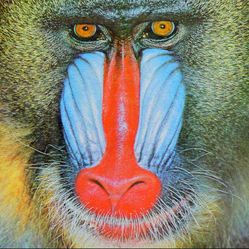

# JPEG Encoder/Decoder User Guide

## 1. High-Performance Results

### 1.1 Compression Visualization (monkey.tiff)

By default, the project processes `test-img/monkey.tiff`.

**File Size Comparison:**
- **Original (`monkey.tiff`):** ~768 KB
- **Compressed (`out.jpg`):** ~63 KB (**12x smaller**)
- **Reconstructed (`rec.png`):** ~598 KB

**Visual Comparison:**
Comparing the Compressed JPEG vs the Reconstructed PNG:

| Compressed JPEG (`out.jpg`) | Reconstructed PNG (`rec.png`) |
|:---:|:---:|
|  |  |
| *Output from my encoder* | *Output from my decoder* |

**Quality Verification:**
- **Original Image:** The source file is [`test-img/monkey.tiff`](test-img/monkey.tiff). You can open it from the `test-img` folder to compare with the results.
- **Visual Check:** Visually, all three images (Original, Encoded, and Decoded) should look identical.

### 1.2 Performance Analysis

To profile the speed of this optimized implementation:

```bash
python profile_run.py
```

This will:
- Run encode & decode once
- Display top 40 functions by execution time
- Open interactive visualization in browser (if snakeviz is installed)

---

## 2. Installation

### 2.1 Build (Choose one of 3 options)

**For both encode & decode:**

```bash
python setup.py build_ext --inplace
```

**For decode only:**

```bash
python setup_decoder.py build_ext --inplace
```

**For encode only:**

```bash
python setup_encoder.py build_ext --inplace
```

---

## 3. Quick Start

### 3.1 Run Encode + Decode Automatically

Single command:

```bash
python main.py
```

Output:
- `out.jpg` - Compressed JPEG image
- `rec.png` - Reconstructed image from JPEG

---

## 4. Advanced Usage (Create Custom Script)

### 4.1 Encode Image to JPEG

Create file `encode_example.py` and copy code below:

```python
from encoder import encode
from PIL import Image
import numpy as np

# Step 1: Load image from file
img = Image.open("input.jpg")

# Step 2: Convert to YCbCr and split channels
y, cb, cr = img.convert('YCbCr').split()

# Step 3: Encode to JPEG
result = encode(
    y_channel=np.array(y),
    cb_channel=np.array(cb),
    cr_channel=np.array(cr),
    img_width=img.width,
    img_height=img.height
)

# Step 4: Save JPEG to file
with open("output.jpg", "wb") as f:
    f.write(result.jpeg_bitstream)

print(f"Done! File size: {len(result.jpeg_bitstream)} bytes")
```

---

### 4.2 Decode JPEG to Image

Create file `decode_example.py` and copy code below:

```python
from decoder import decode
from util import EncodingResult
from PIL import Image
import numpy as np

# Step 1: Load JPEG file
with open("image.jpg", "rb") as f:
    jpeg_data = f.read()

# Step 2: Create EncodingResult object
result = EncodingResult()
result.jpeg_bitstream = jpeg_data

# Step 3: Decode JPEG
ycbcr = decode(result, "jpeg")

# Step 4: Convert YCbCr to RGB
ycbcr_img = Image.fromarray(ycbcr.astype('uint8'), 'YCbCr')
rgb_img = ycbcr_img.convert('RGB')

# Step 5: Save reconstructed image
rgb_img.save("reconstructed.png")

print("Done! Image saved to: reconstructed.png")
```

---

## 5. Advanced Customization

### 5.1 Adjust JPEG Quality

Add `quality` parameter to encode:

```python
result = encode(
    ...,
    quality=85  # 1-100 (higher = better quality + larger file)
)
```

---

## 6. Technical Documentation

For detailed algorithm explanation and mathematical formulas (DCT, Quantization, Huffman...):
 [JPEG_THEORY.md](JPEG_THEORY.md)

---

## 7. Requirements

- numpy>=1.20.0
- opencv-python>=4.5.0
- scipy>=1.7.0
- bitstring>=3.1.9
